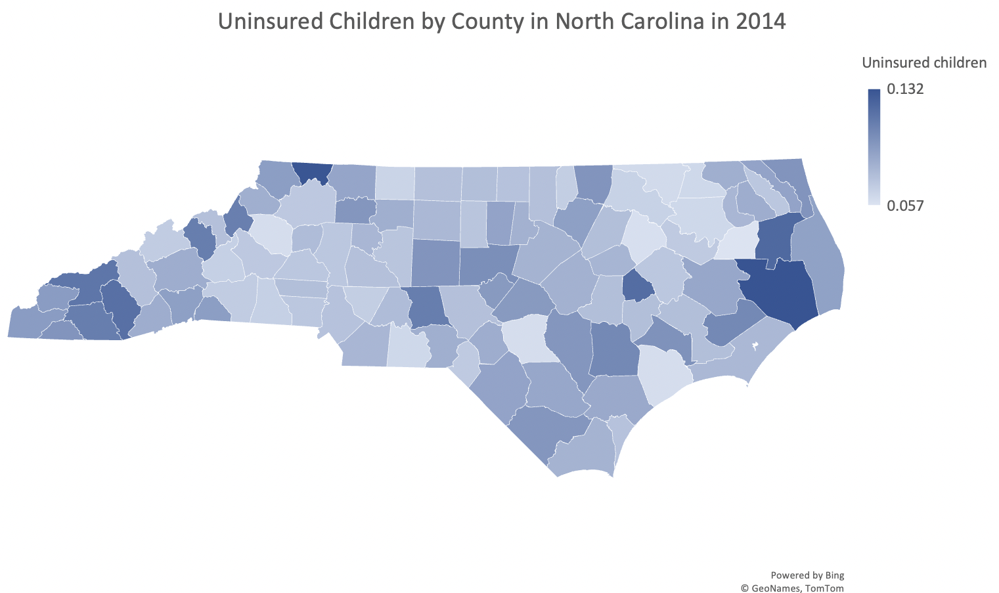

# english105_unit3

This is a repository containing information from a County Health dataset that has been subseted to specifically look at data contained in the "Uninsured children" column in North Carolina by county.

It contains 3 python notebooks:
1. The original dataset
2. The instruction to subset the data
3. The end result after subsetting the data

This dataset is to provide information on the amount of uninsured children in North Carolina by county. 

This dataset can be used to analyze the amount of uninsured children in the North Carolina by county and can be used to produce visuals of the data to help North Carolinians to understand this issue. 

This can help government officials to address the amount of uninsured children and find a solution. 

## Visualization 

This heatmap visualizes the percentage of uninsured children in North Carolina by county.

