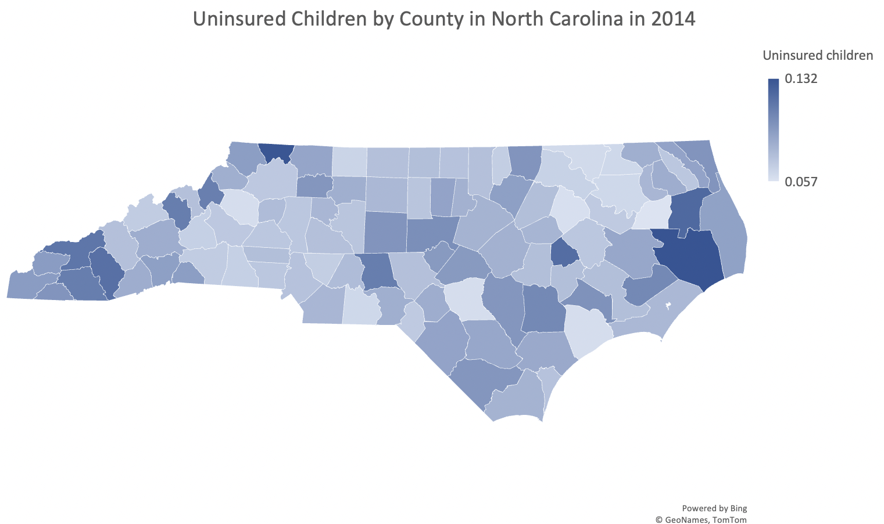

# english105_unit3

This is a repository containing information from a County Health dataset that has been subseted to specifically look at data contained in the "Region" and "Uninsured children" columns. 

It contains 3 python notebooks:
1. The original dataset
2. The instruction to subset the data
3. The end result after subsetting the data

This dataset is to provide information on the amount of uninsured children in the southern region of the United States. 

This dataset can be used to analyze tthe amount of uninsured children in the southern region of the United States.
It also can be used to produce visuals of the data to help Americans to understand this issue. 

