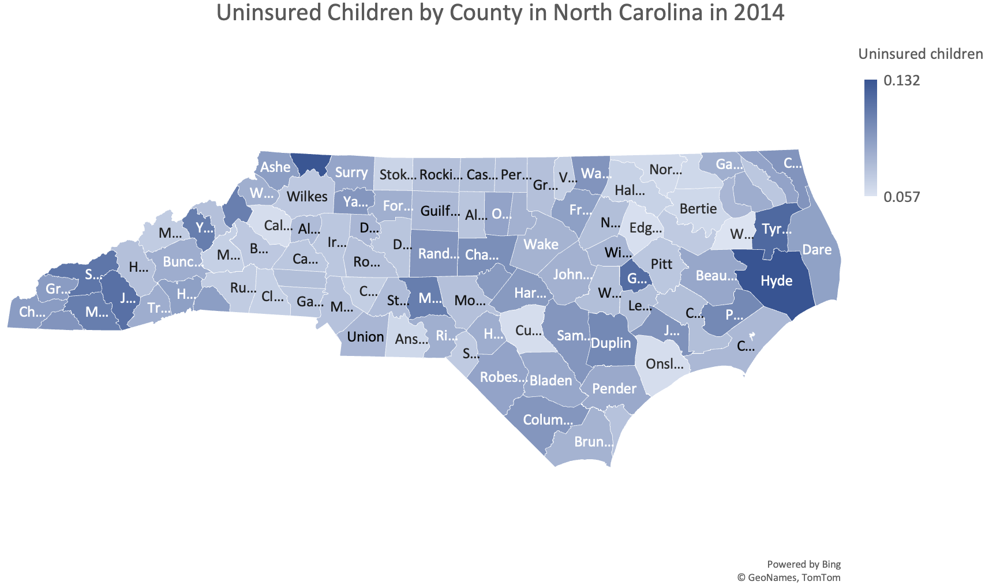

# Uninsured Children in North Carolina 

This is a repository containing information from a [County Health dataset for 2014 and 2015](https://github.com/harpercs/english105_unit3/blob/main/CountyHealthData_2014-2015.csv) that has been subseted to specifically look at data contained in the "Uninsured children" in North Carolina by county in 2014.

It contains 5 files:
1. The original dataset
2. The instructions to subset the data
3. The end result after subsetting the data
4. A visualization of the subsetted data 
5. This README file

This dataset is to provide information on the amount of uninsured children in North Carolina by county in 2014.

This dataset can be used to analyze the amount of uninsured children in the North Carolina by county and can be used to produce visuals of the data to help North Carolinians to understand this issue. 

This can help government officials to address the amount of uninsured children and find a solution. 

## Visualization 

This heatmap visualizes the percentage of uninsured children in North Carolina by county.

#### Acknowledgments 
Thank you Professort Gotztler for providing the [County Health Dataset](https://github.com/harpercs/english105_unit3/blob/main/CountyHealthData_2014-2015.csv) and for providing this project where I learned a lot about coding in Python and how to make a repository. 
